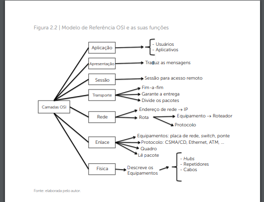

# Protocolos e serviços de rede
## OSI (Open Systems Interconection - Sistemas abertos de conexão)
- Efetua todos processos necessários para que ocorra a transimissão de dados fazendo com que as camadas efetuem a divisão dos processos lógicos
    - Um determinado fabricante tem liberdade de desenvolver seu procolo desde que utilize como referência os parâmetros determinados pela OSI (Protocolo proprietário)

- Para desenvolver uma forma universal de interconexão de sistemas foi desenvolvido um modelo em **sete** camadas
    - Deveria atender os seguintes requisitos:
        1) Cada camada deve executar à função a qual foi destinada
        2) A função das camadas deve ser escolhida em razão dos protocolos que foram padronizados
        3) Os limites entre camadas devem ser escolhidos a fim de minimizar os esforços ao fluxo da mensagens pelas interfaces
        4) O número de camadas deve ser do tamanho suficiente para alocar todas as funcionalidades possíveis nas redes

## Arquitetura
7) Aplicação
    - Local em que os usúarios se comunicão com o computador responsável por provomir disponibilidade dos recursos no dispositivo destino
    - Ex:
        - navegadores: Firefox, Safari
        - servidores web: Apache, netcape, e-mail
        - Banco de dados: mysql, oracle, postgree
6) Apresentação
    - Analisa a semantica e sintaxe dos dados apresentados
        - Analisa-se tipo de dado para que seja utlizada a codificação correta durante a conexão
    - Ex codificação / decodificação: ASCII (American Standard Information Interchange)
5) Sessão
    - Computadores separados geograficamente são conectados nessa camada
    - Gerencia serviços, controla acesso, sincronização e a verificação de status de conexão
4) Transporte
    - Dados são divididos em unidades menores
    - Garente a chegada dos pacotes no destino
    - Determina tipo de serviço de sessão deve utilizar
        - mais comum: conexão ponto a ponto
3) Rede
    - A forma que os dados são roteados da origem ao destino
2) Enlace
    - Fazer a conexão lógica entre as máquinas que estiverem trocando informações
    - Dados provinientes da camada física são transformados em quadros para serem transmitidos
    - Corrige possíveis erros
    - Ex: switchs e bridges
1) Física
    - Define características mecânicas, elétricas, funcionais e os procedimentos para ativar, manter e desativar conexões físicas para a transmissão de bits
    - representa os bits 0s e 1s
    - tempo duração em nanossegundos
    - metodos transmissão: simples, half-duplex ou full-duplex
    - Ex: Hubs, repetidores, cabos

## Controle de fluxo
- Integridade de dados é efetuada na camada de transporte
- Gerante que as requisições feitas pelo usuário sejam confirmadas, recebidas e atendidas
    - Qualquer seguimento que não recebe a confirmação de recebimento é retransmitido
    - Os segmentos são reconstruidos na sua sequência inicial quando recebidos pelo computador
    - Mecanimos de envio e recebimento faz gerência do fluxo a fim de evitar perda de dados e gargalos na rede

## Interação entre as camadas
- Quatro camadas inferiores
    1) Física
        - Bits
    2) Enlace
        - Quadro / frame
    3) Rede
        - Pacote / datagrama
    4) Transporte
        - Segmento
- No processo de transmissão é utilizado tecnica de encapsulamento das mensagens
    - Dados embrulados e depois transimitidos
- Os dados são encapsulados na camada de transporte, ganhando o nome de **segmento**. Em seguida, a camada de rede adiciona os endereços de origem e destino e os encapsula, tornandose assim um **pacote**. Chegando à camada de enlace, segmentamse os dados, aos quais se atribui o nome de **quadro**. Por último, os quadros são transformados em **bits** na camada física e em seguida enviados pelas redes até o seu destino.